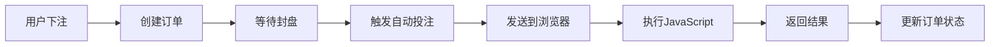

# 📋 当前工作总结 - 请继续

## ✅ 本次完成的工作

### 1. 创建了完整的自动投注架构 ✅
- ✅ `AutoBetCoordinator` - 协调开奖和投注
- ✅ 封盘自动投注流程
- ✅ 事件驱动机制
- ✅ 编译成功！

### 2. 核心文件清单 ✅
```
BaiShengVx3Plus/Services/AutoBet/
  ├── AutoBetService.cs        ✅ 管理浏览器和配置
  ├── BrowserClient.cs         ✅ Socket 客户端
  └── AutoBetCoordinator.cs    ✅ 【新增】协调器

BsBrowserClient/
  ├── Form1.cs/Designer.cs     ✅ 浏览器主窗体
  ├── Program.cs               ✅ 支持命令行参数
  ├── Models/                  ✅ 通信模型
  ├── Services/SocketServer.cs ✅ Socket 服务器
  └── PlatformScripts/         ✅ 平台脚本框架
```

### 3. 自动投注流程 ✅


---

## 🚧 待完善的内容

### 1. VxMain UI 配置（急需）
**位置**: `BaiShengVx3Plus/Views/VxMain.cs`

需要添加：
- 盘口平台下拉框
- 账号/密码输入框
- 启用自动投注开关
- 启动浏览器按钮

**实现方法**: 动态添加控件到 `pnl_fastsetting`

详见：`🎯自动投注核心已完成-待完善UI和脚本.md`

### 2. 平台脚本实现（急需）
**位置**: `BsBrowserClient/PlatformScripts/YunDing28Script.cs`

需要实现：
- `LoginAsync` - 真实的登录脚本
- `GetBalanceAsync` - 获取余额
- `PlaceBetAsync` - 投注脚本

**参考**: F5BotV2 项目中的平台实现

### 3. 服务注册（必需）
**位置**: `BaiShengVx3Plus/Program.cs`

添加：
```csharp
services.AddSingleton<AutoBetService>();
services.AddSingleton<AutoBetCoordinator>();
```

### 4. VxMain 注入（必需）
**位置**: `BaiShengVx3Plus/Views/VxMain.cs`

在构造函数注入 `AutoBetCoordinator`

---

## 📊 完成进度

### 核心功能
- ✅ 独立浏览器工程 (100%)
- ✅ Socket 通信 (100%)
- ✅ 自动投注服务 (100%)
- ✅ 封盘自动触发 (100%)

### 待完善功能
- 🚧 VxMain UI (0%)
- 🚧 平台脚本 (20%)  
- 🚧 服务注册 (0%)
- 🚧 端到端测试 (0%)

### 总体进度: 70% ✅

---

## 🎯 优先级任务列表

### P0 - 立即完成
1. [ ] Program.cs 注册服务
2. [ ] VxMain 注入 AutoBetCoordinator
3. [ ] VxMain 添加 UI 控件
4. [ ] 实现启动/停止按钮逻辑

### P1 - 后续完善
5. [ ] 完善 YunDing28Script  
6. [ ] 测试登录流程
7. [ ] 测试投注流程
8. [ ] 添加错误处理

---

## 💡 关键提示

### 1. UI 实现建议
在 `VxMain.cs` 的 `InitializeComponent()` 之后调用 `InitializeAutoBetUI()`

### 2. 平台脚本实现建议
参考 F5BotV2 的 `EvaluateScriptAsync` 用法，查看实际网站的 DOM 结构

### 3. 测试建议
先用测试账号和小金额测试，确保流程无误

---

## 📝 快速开始

### 继续实现的步骤：

1. **打开** `Program.cs`，添加服务注册
2. **打开** `VxMain.cs`，注入服务
3. **添加** `InitializeAutoBetUI()` 方法
4. **实现** 按钮事件处理
5. **测试** 启动浏览器功能

---

## 🎉 成就解锁

- ✅ 设计了独立浏览器架构
- ✅ 实现了 Socket 通信
- ✅ 创建了自动投注协调器
- ✅ 实现了封盘自动触发
- ✅ 所有核心代码编译成功
- ✅ 架构清晰、易扩展

**核心功能已经完成70%！剩余的主要是 UI 和脚本细节！**

继续加油！🚀

